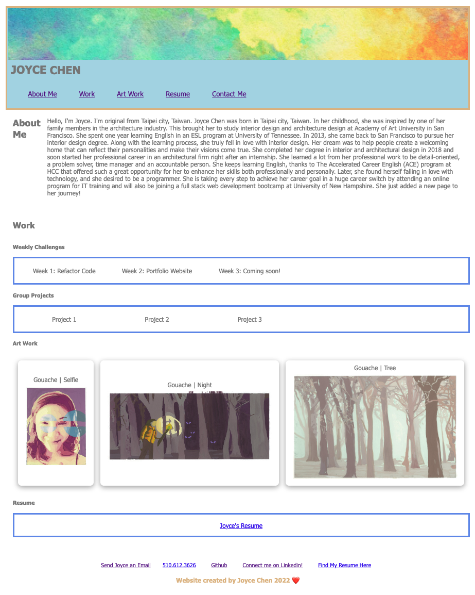

# Module 2 Challenge: Create a portfolio website

## Purpose: 
### A codebase that follows accessibility standards to create a functional website

---

## HTML:

* Applied semantic HTML elements to this website. (header, nav, section, article, main)
* Applied class and id for specific section
* Combined same property for class id flex-container-a, b, c, and d
* Combined same property for same image property
* Applied id to specific area for navagation links
* Applied img source for art work
* Applied a hyperlink for pdf
* Applied hyperlinks for footer section (contact-me section)

## CSS:

* Applied font-family, font-size, font-style to words
* Applied background-color to specific area
* Applied flexbox, flex-direction, and flex-wrap in css
* Applied similar elements from the referecne image for this assignment
* Combined same property for same image property

---

## Deployed Image: 

---

## Images Use: 
![This website includes ] ![Joyce's website screenshot can be found here.]

(./assets/images/cloud.jpeg)
(./assets/images/gouache-selfi.jpg")
(./assets/images/gouache-night.jpg")
(./assets/images/gouache-tree.jpg)

---

## Required to submit the following URL for review:

* Github URL: https://github.com/Joyce750526/joycechen-portfolio-website

* Github Deployed Page: https://joyce750526.github.io/joycechen-portfolio-website/

---

Chao-Ying (Joyce) Chen
